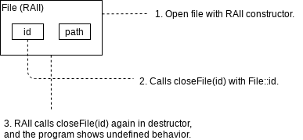

Using RAII for open-close pair
============================================= 

Terms 
--------------- 
Action 
	In this article, this term may mean programming actions, such as 
	calling functions, modifying variable, writing to stream, or more. 

Open-close action
	Actions which requires pair of opening and closing actions. Read 
	*open[ing] action* and *clos[e | ing] action* for more details. 

Open[ing] action 
	Actions which *clos[e | ing] action* should be accompanied, when itself 
	is successfully done. (ex. A file object failed to be opened doesn't 
	need to be closed, otherwise it should be closed.)

Clos[e | ing] action 
	Actions which should be followed, if matching open[ing] action is 
	successfully done. 

Background 
---------------- 
Some programming actions must be accompanied with matching closing actions, 
in any case. 
Memory deallocation, closing file and socket connections, and unlocking 
mutex for concurrent programming are the examples. 
This can be accomplished
by writing closing code in reverse order after required jobs are done. 

.. code-block:: cpp

	// Opening. 
	auto const file = openFile("file_name.png"); 
	auto const socket = openSocket("receiver.link.org"); 

	// Do something with file and socket. 
	copy_file_to_socket(file, socket); 

	// Closing. 
	// Attention that closing actions should be done in 
	// reverse order of opening actions. 
	closeSocket(socket); 
	closeFile(file); 

This code is usually come up with beginner programmers who do not care about 
code jump done by programming language. 
Though there are few programming languages which do not allow any kinds of 
code jump, most of modern ones provide code jump or alternatives. 
Features listed below can cause explicit or implicit code jumps. 

* `Code jump`_ 
* `Go-to`_ 
* `Exception handling`_
* `Function return`_
* `Break and continue`_
* `Program termination`_

Code jump 
%%%%%%%%%%%%%%
Literally, code jump can cause code jump, which can cause omitting 
closing code. The example below shows how code jump can cause disaster. 

.. code-block:: cpp 

	auto const file = openFile("file_name.png"); 
	auto const socket = openSocket("receiver.link.org"); 

	does(); 
	something(); 
	if ( condition() ) 
	{ 
		// Used go-to instead, since c++ does not support jump. 
		// If this is called, closing code will be ignored. 
		goto asdf; 
	}
		
	closeSocket(socket); 
	closeFile(file); 

	asdf: 

Go-to
%%%%%%%%%%
Go-to statement is almost same with `Code jump`_: 
only the names are different. 

Exception handling 
%%%%%%%%%%%%%%%%%%%%%%%
Exception handling feature let a program flow can be jumped to somewhere 
else when exception is occured, so that code depends on prior code is not 
excuted. Of course, those ignored code may contain closing actions. 

Function return 
%%%%%%%%%%%%%%%%%%%
When a function meets its end, the function is returned automatically. 
However, it can be done by using ``return`` keyword explicitly as well. 
If this keyword is used before closing actions are done, the code has 
potential of missing closing actions. 

Break and continue 
%%%%%%%%%%%%%%%%%%%%%%%%
Break and continue features are used in a loop statement such as ``for`` or 
``while``. Break ignores extra code in the loop and quit cycling, and 
continue does similar jobs except that continue invokes the loop again. 

Program termination 
%%%%%%%%%%%%%%%%%%%%%%
Sometimes a program is terminated without returning of its main function, 
which is usually unexpected behavior or caused from a programmer's mistake. 
This case is ignorable, since it's usually not happen in ordinary 
circumstances, and even RAII cannot handle this problem. 

To solve this problem, many programming languages adopted 
*try-catch-finally* statement, which enforces code in *finally* part 
is run in any case, when a program flow trying to escape from the 
*try-catch* scope. This feature let the problem can be solved in elegant 
way, while it still missing few desired features. 

*try-catch-finally* statement does not force closing actions 
to be done in reverse order 
of opening actions, nor force closing code should be used. This 
expression does not produce any of compile error even if we write 
``openFile()`` and omit ``closeFile()``. 

Some programming languages do not provide exception handling and *try-catch* 
staement. Few languages only support *try-catch* for exception handling, 
but not *finally*. To solve this problem without *finally* statement, 
RAII can be used. 

Introduction 
-----------------------
*RAII*, which is abbreviation of *Resource Acquisition Is Initialization*, 
is a technique uses constructor and destructor. 

Using of RAII brings a lot of advantages than using raw code or using 
*finally* statement. By using a class which 
contains opening code in constructor and closing code in destructor, 
programmers could have guaranteed that closing code must be called if 
opening code is successfully called. If opening code fails, closing code 
will not be called as well. Destruction is done in reverse order of 
construction, so order of closing actions are 
guaranteed as well. 

.. code-block:: cpp 

	struct File 
	{ 
		// Start of OAP
		File(char const* path) 
		{ 
			fileId = openFile(path); 
			this->path = path; 
		} 
		char const* const path; 
		// End of OAP

		// Start of CAP
		~File() 
		{ 
			closeFile(fileId); 
		} 
		int fileId; 
		// End of CAP
	}; 
	struct Socket 
	{ 
		// Start of OAP
		Socket(char const* path) 
		{
			socketId = openSocket(path);  
			this->path = path; 
		}
		char const* const path; 
		// End of OAP

		// Start of CAP
		~Socket() 
		{ 
			closeSocket(socketId); 
		} 
		int socketId; 
		// End of CAP
	}; 
	int main() 
	{ 
		File file("file_name.png"); 
		Socket sock("receive.link.org"); 

		copy_file_to_socket(&file, &socket); 

		return 0; 
	} 

This is a RAII version of the example at the beginning. Opening code is  
replaced into object construction, and closing code is removed, since 
destructor will be called automatically if the program goes out of 
``main()`` function scope. 

Details 
------------------ 
By dividing RAII idiom, there are *Opening Action part*\ (OAP) and 
*Closing Action part*\ (CAP). OAP contains constructor and 
variables used in opening. CAP contains destructor and 
variables used in closing. Variables used in opening and closing can be 
shared: it means a variable can be both OAP and CAP. 
Both parts may have no variable, if they do not need them. 
For instance, mutex lock does not require any of OAP variable, 
not like open file, which requires file name or path. 

Mutation: Post-openable and pre-closable RAII(POPC-RAII)
%%%%%%%%%%%%%%%%%%%%%%%%%%%%%%%%%%%%%%%%%%%%%%%%%%%%%%%%
RAII doesn't need to do opening action in constructor and closing action in 
destructor. RAII can be implemented so that opening actions can be done 
after RAII's constructor is called and closing actions can be done before 
destructor is called. If it's closed, it can be re-opened as well. Of course, 
this comes with a little bit more cost, more code and more performance loss. 

This mutation introduces one more part, *Status Checking part*\ (SCP). 
SCP includes functions and variables used to check whether the RAII instance 
should do closing actions or not. 

.. code-block:: cpp 

	struct File
	{ 
		// Start of OAP.
		File() // Constructor does not call opening code. 
		{ 
		} 
		File(char const* path) // Constructor calls opening code. 
		{ 
			open(path); 
		} 
		void open(char const* path) 
		{ 
			this->path = path; 
			id = openFile(path); 
		} 
		char const* path; 
		// End of OAP.

		// Start of CAP.
		~File() 
		{ 
			close(); 
		} 
		// Safe-version of forceClose(). 
		void close()
		{ 
			if ( isOpened() ) 
			{ 
				forceClose(); 
			} 
		} 
		void forceClose() 
		{
			closeFile(id); 
		} 
		int id  = 0; // Both CAP and SCP. 
		// End of CAP. 

		// Start of SCP 
		bool isOpened() const 
		{ 
			return id != 0; 
		} 
		void ignore() 
		{ 
			id = 0; 
		} 
		// End of SCP 

		File(File const& another) 
		{ 
			if ( another.isOpened() ) 
			{ 
				path = another.path; 
				id = another.id; 

				another.ignore(); 
			} 
		} 
		File& operator =(File const& another) 
		{ 
			close(); 

			if ( another.isOpened() ) 
			{ 
				path = another.path; 
				id = another.id; 

				another.ignore(); 
			} 
		} 
	};

This is implementation of POPC-RAII. New part SCP is introduced, and move 
constructor and operator are implemented. Below describes difference between 
primeval RAII and POPC-RAII. 

Constructor and destructor do not represent opening code and closing code, 
instead code are separated into ``open()``, ``close()`` and ``forceClose()`` 
functions. Constructor simply determines that the user want to run opening 
actions right away(if constructor has parameter) and calls ``open()`` if it 
is. Destructor calls ``close()`` to call closing actions safely, since 
opening actions could be not performed or closing actions could be already 
proceeded. ``close()`` calls ``forceClose()`` only if ``isOpened()`` returns 
true. 

``id`` variable, which is descriptor id of file, has 2 usages. First it can be 
used as key when performing closing actions, and second, determines whether 
the file is opened or not. 0 value of id means closed file, otherwise it means 
opened file. ``isOpened()`` returns true if ``id`` is not 0, otherwise returns 
false. This is the reason why ``id`` is both CAP and SCP. This kinds of 
pattern can be used in many places, since many libraries left negative, 
null or 0 value to represent null and invalid state. For example, null pointer 
of an object can represent that the object is not constructed. 

POPC-RAII can be moved, which is the new feature first-introduced in C++11. 
Primeval RAII cannot be moved, since destructor will call closing code without 
any exception, and moving it will be end up with proceeding closing actions 
twice or more. Since POPC-RAII can be closed during its lifetime, moving 
is not non-sense. 

There are 2 concepts, *source* and *target*. They means as what their names 
say. In below code, *A* is source and *B* is target. 

.. code:: cpp 

	B = A; 

When move-constructor is called, the target should have no file id. If the 
source is valid, data should be moved and ``ignore()`` of source must be 
called, to represent the source is not valid any more. 
``ignore()`` simply let the RAII is not responsible to run closing actions. 
It should make the RAII's ``isOpened()`` returns false without closing. 
Implementing 
move-operator need to have one more step, calling ``close()`` before do move 
operation, since it may have previous opened file. 

Rule of One-Entry
--------------------- 
RAII can be used in various situations, and sometimes destructing RAII or 
calling something like ``close()`` is not the only option to run closing 
actions. 

The case above can happen if how a RAII class is not properly documented. 
Hiding ``File::id`` is one option, but sometimes the variable must be used 
for other purposes which is not closing. 

The most safe way to handle this is making RAII as the only way to do 
closing actions, and this is the only-option for primeval RAII. Also this 
is the cleanest way, and the most straight-forwarding way. 

If POPC-RAII 
is used, making closing function like following one can be another solution. 

.. code-block:: cpp 

	void closeFile(File* raii) 
	{ 
		closeFile(raii->id); 
		raii->ignore(); // Release responsibility of calling closing actions. 
	} 

But still the function requires pointer of RAII instance. 
